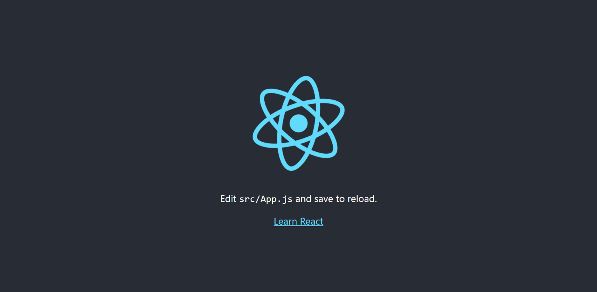

# React.js Türkçe Kaynak

## Giriş ve Tanışma

React.js ile ilgili içeriklere başlamadan önce kısaca kendimden bu kaynağın yapılış amacından bahsedeyim. İsmim **Orçun Tuna**, yazılım mühendisi adayıyım. Bu kaynak ile sizlerin günümüzün en popüler ön yüz kütüphanesi olan React'ı öğrenmesini amaçlıyorum. Bu projenin çıkış noktası ise ücretsiz yazılım kaynakları sunan goalkicker oldu. Aynı şekilde Türkçe olarak da detaylı bir kaynak olması açısından bu dökümanı baz alarak bu kaynağı hazırlamaya başladım. Bahsettiğim kaynak üzerindeki bilgileri çeviri ile sizlere sunmayacağım. Kendim düzenlemeler, eklemeler ve çıkarmalar yapacağım. Ama genel olarak rotamızı oradan kopya çekerek ilerleteceğiz. Bu kaynak GitHub üzerinde paylaşılacağı için eksik veya yanlış gördüğünüz yerleri "pull request" göndererek kaynağı iyileştirmeme yardımcı olabilirsiniz.

## Nelere İhtiyacımız Olacak?

React bir javascript kütüphanesi ve javascript platform bağımsız çalışan bir dil olduğundan işletim sistemi olarak herhangi bir kısıtlamamız yok. Aynı şekilde editör tarafında da birçok editör veya ide arasından seçim yapabilirsiniz. Geliştirme yaparken kullanabileceğiniz birkaç editörü yazalım bunlar arasından tercihinizi siz yapın.

- Visual Studio Code

- WebStorm (ide)

- Atom

- Sublime Text

- Brackets

Benim tavsiyemi soracak olursanız eğer öğrenci iseniz JetBrains ürünlerinden ücretsiz faydalanarak WebStorm kullanmanızı öneririm. Değilseniz üzülmeyin, VS Code'da çok kaliteli ve işinizi fazlasıyla görecek bir editör.

Kurulum tarafında ihtiyacımız olacak yazılım ise NPM ve Node.js olacak. Bunları da kolaylıkla indirip platform bağımsız şekilde kurabilirsiniz.

Geldik programlama dillerine, aşağıdakileri bilmeden maalesef react öğrenmeye başlayamazsınız. Eğer listedeki dil veya kavramlardan eksiğiniz var ise öncelikle bunları tamamlayıp sonrasında buraya dönmenizi tavsiye ederim. Aksi halde çoğu şeyi anlayamayabilirsiniz.

- HTML

- CSS

- JavaScript + Biraz da olsa ECMAScript

## React Nedir?

React, Facebook tarafından geliştirilen ve açık kaynaklı bir front-end kütüphanesidir. Ayrıca daha önce duymuş olabileceğiniz "component based" yani bileşen tabanlıdır.

Ayrıca React DOM'u kullanarak sanal bir DOM (Document Object Model) oluşturur. Bu sayede sayfa üzerinde bir değişiklik olduğunda tüm sayfayı güncellemek yerine sadece değişiklik yapılan kısmı güncellerek. Böylelikle performans tarafında fark gerçek DOM'a göre daha hızlı çalışır.

React içerisinde JSX adı verilen özel bir biçimlendirme dili kullanılır. React bu JSX kodlarını HTML kodlarına dönüştürür ve tarayıcı tarafından çalıştırılmasını sağlar. JSX denildiğinde gözünüz korkmasın. Neredeyse birebir olarak HTML şeklinde fakat kendine özgü birkaç özelliği daha olan bir biçimlendirme dili.

İlk paragrafta basettiğim bileşen tabanlılık özelliği ile geliştirme tarafında büyük kolaylıklar sağlar. Bunu şu şekilde basit bir örnek ile açıklayabiliriz. Bir yemek tarifi sitesinin anasayfasını düşünelim. Header, footer, sidebar ve yemek tariflerinin bulunduğu kartlar var. Buradaki her bir alanı bir bileşen olarak böleriz ve bunları tekrar tekrar kullanabiliriz. Header bileşeni, yemek tarifi kartı bileşeni ve bu şekilde bileşenleri oluştururuz.

Bu kısımda son olarak react'ın neden bir framework değilde kütüphane olduğunu konuşalım. Framework ve kütüphane ayrımı front-end tarafında içinde router bulunup bulunmadığına bakılarak karar veriliyor. React.js içinde varsayılan olarak bir router bulunmadığı için react'a kütüphane diyebiliriz. Router kısmını ise ileride react-router veya next.js gibi ekstra çözümler ile halletmeye çalışacağız.

## Webpack ve Babel Kavramları

Geliştirmeye başlamadan önce webpack ve babel kavramları hakkında bilgi sahibi olunması gerektiğini düşünüyorum. Şayet bunları sıklıkla kullancağız ve ne olduklarını bilmeden kullanmamız saçma olacaktır.

### Webpack


Bildiğiniz gibi javascript üzerinde farklı kodları içeri aktarıp bir dosya üzerinden kodlamaya devam edebileceğimiz bir sistem mevcut değil (Python'daki import, PHP'deki include gibi). Burada webpack devreye giriyor. Webpack oluşturduğumuz dosyalar arasında içeri aktarma yapmamızı sağlıyor. Sonrasında ise bir bundle dosyasında tüm içerikleri bir araya getiriyor. Böylelikle javascript üzerinde import işlemi yapabilmiş oluyoruz.

### Babel

Gereksinimler kısmında javascript yanında biraz da ecmascript demiştik. Babel'in görevi ecmascript üzerine ve bu yüzden ecmascript'e biraz hakim olmak gerekiyor.

Şuanda kullandığımız tarayıcılar tam olarak bütün ecmascript sürümlerini maalesef destekleyemiyorlar. Bu yüzden tarayıcının bizim kodlarımızı anlayabilmesi için ecmascript kodlarını daha düşük ecmascript versiyonlarına çevirmemiz gerekiyor.

Babel tam olarak bu işi yapıyoruz. Böylelikle daha modern ve anlaşılır kod yazabiliyoruz.

## Kurulum ve create-react-app

Yeni bir react projesi oluşturmak için create-react-app paketini kullanacağız. Paket kullanılmadan manuel olarak da react projeleri oluşturulabilir. Fakat hem çok fazla kullanılmadığı hem de başlangıçta kafa karışıklığına sebep olmamak için bu kısımdan bahsetmeyeceğim. Direkt olarak kurulumumuzu create-react-app paketini kullanarak yapacağız.

create-react-app paketi Facebook tarafından sunulan react proje oluşturma aracı. Bu aracı kullanarak manuel olarak yapmamız gereken her şeyden kurtulacağız. Paket bize hazır olarak şunları sağlıyor:

1. ES6 ve JSX çevrimi

2. Geliştirme sunucusunda değişiklik yapıldığında otomatik yenileme

3. Kodlama standartları ile çalışma (eslint)

4. Otomatik CSS tamamlama

5. JS, CSS ve Görsel dosyaları paketleme

6. Jest Unit Test ortamı

Kuruluma başlamak için gereksinimlerdeki npm uygulamasını yüklemiş olmanız gerekiyor. Bundan sonraki kısımlarda işlemlerimizi terminal üzerinden yürüteceğiz. Eğer Linux tabanlı bir işletim sistemi kullanıyorsanız sisteminizin kendi terminalini kullanabilirsiniz. Windows kullanıyorsanız "Git bash" kullanmanızı tavsiye ederim. Eğer onu kullanmayacaksanız cmd yerine powershell kullanın. Böylece en azından komutları farklılık olmadan -umuyorum ki- çalıştırabilirsiniz.

```bash
npx create-react-app ilk-uygulama
```

Bu komut ile proje dosyalarını oluşturduktan sonra proje dizinine gidelim ve uygulamamızı ayağa kaldıralım.

```bash
cd ilk-uygulama
npm start
```

Şuanda yerel sunucunuzda react çalışır durumda olması gerekiyor. Otomatik olarak tarayıcınızda bağlantı açılacaktır eğer açılmaz ise, tarayıcınızda adres çubuğuna **http://localhost:3000** yazarak bağlanabilirsiniz. Karşılaşmanız gereken ekran şu şekilde olmalı:



package.json dosyasını incelerseniz "scripts" kısmında kullanabileceğiniz bazı komutlara rastlayacaksınız. Buradaki start, build, test ve eject komutlarını kısaca inceleyelim.

- **npm run start:** geliştirme ortamında react uygulamasını ayağa kaldırır.

- **npm run build:** geliştirme ortamından canlı ortalama transfer için build işlemini gerçekleştirir.

- **npm run test:** projemize dahil olan jest ile hazırladığınız testleri çalıştırır.

- **npm run eject:** proje dosyaları içinde görmediğimiz server ve config dosyalarını manuel olarak yönetmek için dışarı çıkarır. Bu işlem yapılmak isteniyorsa proje oluşturulduğunda hiçbir ekleme ve düzenleme yapılmadan çalıştırılmalıdır. Aksi halde çalışmaz ve bu komutu çalıştırırken dikkatli olunması gerekir çünkü kalıcı bir zarar verebilir.
