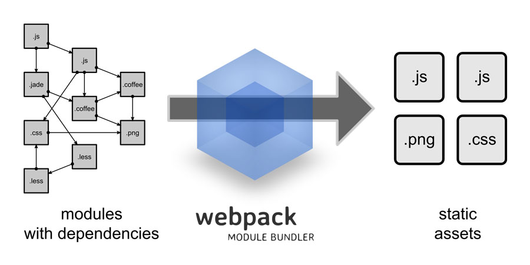
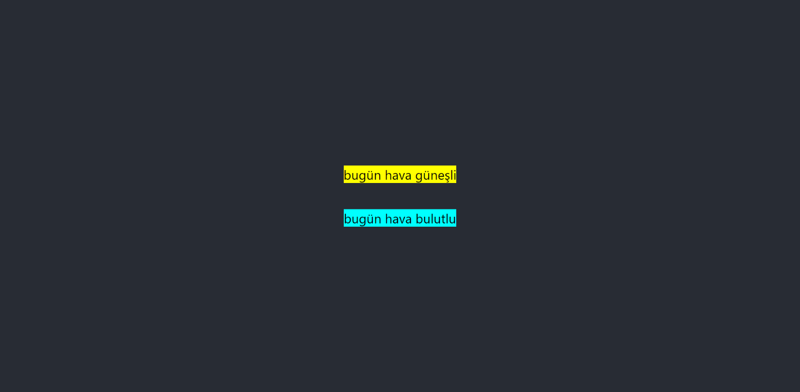
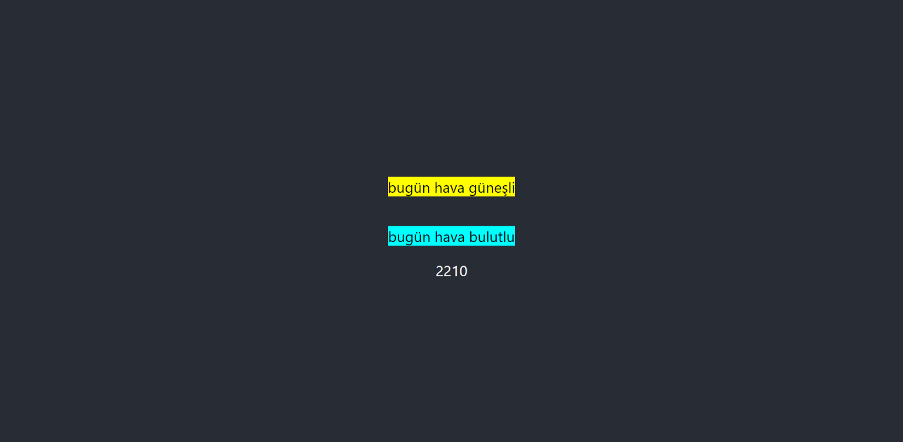
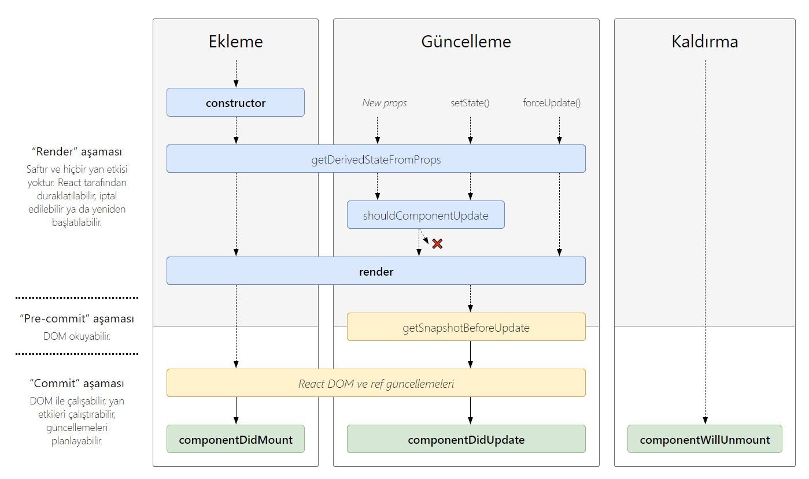
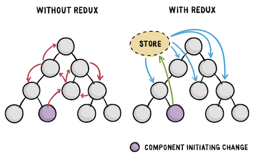
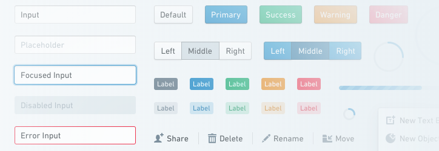
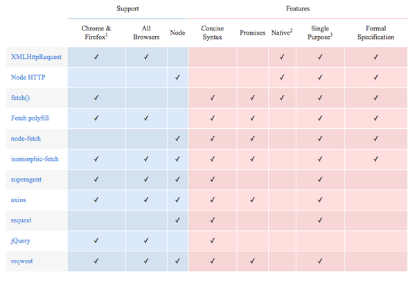
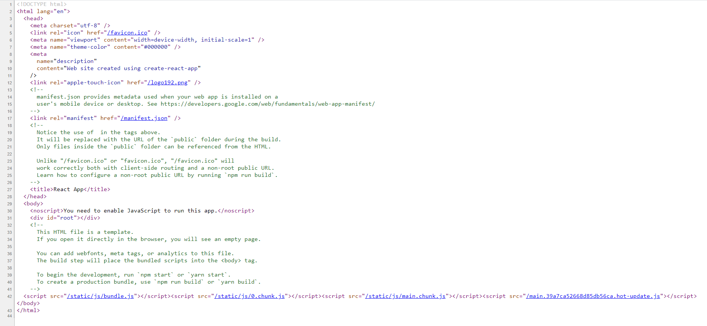

# React.js Türkçe Kaynak


## İçindekiler

1. [Giriş ve Tanışma](#giriş-ve-tanışma)
2. [Nelere İhtiyacımız Olacak?](#nelere-i̇htiyacımız-olacak)
3. [React Nedir?](#react-nedir)
4. [Webpack ve Babel Kavramları](#webpack-ve-babel-kavramları)
   1. [Webpack](#webpack)
   2. [Babel](#babel)
5. [Kurulum ve create-react-app](#kurulum-ve-create-react-app)
6. [JSX ve HTML](#jsx-ve-html)
7. [Bileşenler (components)](#bileşenler-components)
   1. [Bileşeni Dışarı Aktarmak](#bileşeni-dışarı-aktarmak)
8. [Props (Bileşen Parametreleri)](#props-bileşen-parametreleri)
   1. [Prop Types ile Kısıtlama ve Zorlama](#prop-types-ile-kısıtlama-ve-zorlama)
   2. [Varsayılan Prop Değerlerini Belirlemek](#varsayılan-prop-değerlerini-belirlemek)
9. [State](#state)
   1. [jQuery tarafında state mantığı](#jquery-tarafında-state-mantığı)
10. [Yaşam Döngüsü](#yaşam-döngüsü)
11. [Olay Yönetimi (Events)](#olay-yönetimi-events)
    1. [Eventler için Bind](#eventler-için-bind)
    2. [Event'ler ile Parametre Göndermek](#eventler-ile-parametre-göndermek)
12. [Bileşenler Arasında İletişim](#bileşenler-arasında-i̇letişim)
    1. [Üst'ten Alt Bileşene Erişim (Parent to Child)](#1-üstten-alt-bileşene-erişim-parent-to-child)
    2. [Alt'dan Üst Bileşene Erişim (Child to Parent)](#2-altdan-üst-bileşene-erişim-child-to-parent)
    3. [Alt-Üst İlişkisi Olmayan Bileşenlere Erişim](#3-alt-üst-i̇lişkisi-olmayan-bileşenlere-erişim)
13. [React Router](#react-router)
14. [UI Kütüphanesi Dahil Etmek (bootstrap vs.)](#ui-kütüphanesi-dahil-etmek-bootstrap-vs)
15. [React Fragment](#react-fragment)
16. [Hook'lara Giriş](#hooklara-giriş) 
    1. [Hook'lar ile State Kullanımı](#hooklar-ile-state-kullanımı)
    2. [Hook'lar ile Effect Kullanımı](#hooklar-ile-effect-kullanımı)
17. [API Kullanımı (axios)](#api-kullanımı-axios)
18. [Döngülerde Key Kullanımı](#döngülerde-key-kullanımı)
19. [Server Side Rendering](#server-side-rendering)
20. [Build Almak (create-react-app)](#build-almak-create-react-app)
21. [Çoklu import/export Kullanımı (webpack)](#çoklu-importexport-kullanımı-webpack)
22. [Kapanış](#kapanış)

## Giriş ve Tanışma

React.js ile ilgili içeriklere başlamadan önce kısaca kendimden bu kaynağın yapılış amacından bahsedeyim. İsmim **Orçun Tuna**, yazılım mühendisi adayıyım. Bu kaynak ile sizlerin günümüzün en popüler ön yüz kütüphanesi olan React'ı öğrenmesini amaçlıyorum. Bu projenin çıkış noktası ise ücretsiz yazılım kaynakları sunan goalkicker oldu. Aynı şekilde Türkçe olarak da detaylı bir kaynak olması açısından bu dökümanı baz alarak bu kaynağı hazırlamaya başladım. Bahsettiğim kaynak üzerindeki bilgileri çeviri ile sizlere sunmayacağım. Kendim düzenlemeler, eklemeler ve çıkarmalar yapacağım. Ama genel olarak rotamızı oradan kopya çekerek ilerleteceğiz. Bu kaynak GitHub üzerinde paylaşılacağı için eksik veya yanlış gördüğünüz yerleri "pull request" göndererek kaynağı iyileştirmeme yardımcı olabilirsiniz.

## Nelere İhtiyacımız Olacak?

React bir javascript kütüphanesi ve javascript platform bağımsız çalışan bir dil olduğundan işletim sistemi olarak herhangi bir kısıtlamamız yok. Aynı şekilde editör tarafında da birçok editör veya ide arasından seçim yapabilirsiniz. Geliştirme yaparken kullanabileceğiniz birkaç editörü yazalım bunlar arasından tercihinizi siz yapın.

- Visual Studio Code

- WebStorm (ide)

- Atom

- Sublime Text

- Brackets

Benim tavsiyemi soracak olursanız eğer öğrenci iseniz JetBrains ürünlerinden ücretsiz faydalanarak WebStorm kullanmanızı öneririm. Değilseniz üzülmeyin, VS Code'da çok kaliteli ve işinizi fazlasıyla görecek bir editör.

Kurulum tarafında ihtiyacımız olacak yazılım ise NPM ve Node.js olacak. Bunları da kolaylıkla indirip platform bağımsız şekilde kurabilirsiniz.

Geldik programlama dillerine, aşağıdakileri bilmeden maalesef react öğrenmeye başlayamazsınız. Eğer listedeki dil veya kavramlardan eksiğiniz var ise öncelikle bunları tamamlayıp sonrasında buraya dönmenizi tavsiye ederim. Aksi halde çoğu şeyi anlayamayabilirsiniz.

- HTML

- CSS

- JavaScript + Biraz da olsa ECMAScript

## React Nedir?

React, Facebook tarafından geliştirilen ve açık kaynaklı bir front-end kütüphanesidir. Ayrıca daha önce duymuş olabileceğiniz "component based" yani bileşen tabanlıdır.

Ayrıca React DOM'u kullanarak sanal bir DOM (Document Object Model) oluşturur. Bu sayede sayfa üzerinde bir değişiklik olduğunda tüm sayfayı güncellemek yerine sadece değişiklik yapılan kısmı güncellerek. Böylelikle performans tarafında fark gerçek DOM'a göre daha hızlı çalışır.

React içerisinde JSX adı verilen özel bir biçimlendirme dili kullanılır. React bu JSX kodlarını HTML kodlarına dönüştürür ve tarayıcı tarafından çalıştırılmasını sağlar. JSX denildiğinde gözünüz korkmasın. Neredeyse birebir olarak HTML şeklinde fakat kendine özgü birkaç özelliği daha olan bir biçimlendirme dili.

İlk paragrafta basettiğim bileşen tabanlılık özelliği ile geliştirme tarafında büyük kolaylıklar sağlar. Bunu şu şekilde basit bir örnek ile açıklayabiliriz. Bir yemek tarifi sitesinin anasayfasını düşünelim. Header, footer, sidebar ve yemek tariflerinin bulunduğu kartlar var. Buradaki her bir alanı bir bileşen olarak böleriz ve bunları tekrar tekrar kullanabiliriz. Header bileşeni, yemek tarifi kartı bileşeni ve bu şekilde bileşenleri oluştururuz.

Bu kısımda son olarak react'ın neden bir framework değilde kütüphane olduğunu konuşalım. Framework ve kütüphane ayrımı front-end tarafında içinde router bulunup bulunmadığına bakılarak karar veriliyor. React.js içinde varsayılan olarak bir router bulunmadığı için react'a kütüphane diyebiliriz. Router kısmını ise ileride react-router veya next.js gibi ekstra çözümler ile halletmeye çalışacağız.

## Webpack ve Babel Kavramları

Geliştirmeye başlamadan önce webpack ve babel kavramları hakkında bilgi sahibi olunması gerektiğini düşünüyorum. Şayet bunları sıklıkla kullancağız ve ne olduklarını bilmeden kullanmamız saçma olacaktır.

### Webpack



Bildiğiniz gibi javascript üzerinde farklı kodları içeri aktarıp bir dosya üzerinden kodlamaya devam edebileceğimiz bir sistem mevcut değil (Python'daki import, PHP'deki include gibi). Burada webpack devreye giriyor. Webpack oluşturduğumuz dosyalar arasında içeri aktarma yapmamızı sağlıyor. Sonrasında ise bir bundle dosyasında tüm içerikleri bir araya getiriyor. Böylelikle javascript üzerinde import işlemi yapabilmiş oluyoruz.

### Babel

Gereksinimler kısmında javascript yanında biraz da ecmascript demiştik. Babel'in görevi ecmascript üzerine ve bu yüzden ecmascript'e biraz hakim olmak gerekiyor.

Şuanda kullandığımız tarayıcılar tam olarak bütün ecmascript sürümlerini maalesef destekleyemiyorlar. Bu yüzden tarayıcının bizim kodlarımızı anlayabilmesi için ecmascript kodlarını daha düşük ecmascript versiyonlarına çevirmemiz gerekiyor.

Babel tam olarak bu işi yapıyoruz. Böylelikle daha modern ve anlaşılır kod yazabiliyoruz.

## Kurulum ve create-react-app

Yeni bir react projesi oluşturmak için create-react-app paketini kullanacağız. Paket kullanılmadan manuel olarak da react projeleri oluşturulabilir. Fakat hem çok fazla kullanılmadığı hem de başlangıçta kafa karışıklığına sebep olmamak için bu kısımdan bahsetmeyeceğim. Direkt olarak kurulumumuzu create-react-app paketini kullanarak yapacağız.

create-react-app paketi Facebook tarafından sunulan react proje oluşturma aracı. Bu aracı kullanarak manuel olarak yapmamız gereken her şeyden kurtulacağız. Paket bize hazır olarak şunları sağlıyor:

1. ES6 ve JSX çevrimi

2. Geliştirme sunucusunda değişiklik yapıldığında otomatik yenileme

3. Kodlama standartları ile çalışma (eslint)

4. Otomatik CSS tamamlama

5. JS, CSS ve Görsel dosyaları paketleme

6. Jest Unit Test ortamı

Kuruluma başlamak için gereksinimlerdeki npm uygulamasını yüklemiş olmanız gerekiyor. Bundan sonraki kısımlarda işlemlerimizi terminal üzerinden yürüteceğiz. Eğer Linux tabanlı bir işletim sistemi kullanıyorsanız sisteminizin kendi terminalini kullanabilirsiniz. Windows kullanıyorsanız "Git bash" kullanmanızı tavsiye ederim. Eğer onu kullanmayacaksanız cmd yerine powershell kullanın. Böylece en azından komutları farklılık olmadan -umuyorum ki- çalıştırabilirsiniz.

```bash
npx create-react-app ilk-uygulama
```

Bu komut ile proje dosyalarını oluşturduktan sonra proje dizinine gidelim ve uygulamamızı ayağa kaldıralım.

```bash
cd ilk-uygulama
npm start
```

Şuanda yerel sunucunuzda react çalışır durumda olması gerekiyor. Otomatik olarak tarayıcınızda bağlantı açılacaktır eğer açılmaz ise, tarayıcınızda adres çubuğuna **http://localhost:3000** yazarak bağlanabilirsiniz. Karşılaşmanız gereken ekran şu şekilde olmalı:


package.json dosyasını incelerseniz "scripts" kısmında kullanabileceğiniz bazı komutlara rastlayacaksınız. Buradaki start, build, test ve eject komutlarını kısaca inceleyelim.

- **npm run start:** geliştirme ortamında react uygulamasını ayağa kaldırır.

- **npm run build:** geliştirme ortamından canlı ortalama transfer için build işlemini gerçekleştirir.

- **npm run test:** projemize dahil olan jest ile hazırladığınız testleri çalıştırır.

- **npm run eject:** proje dosyaları içinde görmediğimiz server ve config dosyalarını manuel olarak yönetmek için dışarı çıkarır. Bu işlem yapılmak isteniyorsa proje oluşturulduğunda hiçbir ekleme ve düzenleme yapılmadan çalıştırılmalıdır. Aksi halde çalışmaz ve bu komutu çalıştırırken dikkatli olunması gerekir çünkü kalıcı bir zarar verebilir.

create-react-app haricinde react projesi oluşturmak için birçok farklı alternatif araç mevcut. Biz facebook tarafından geliştirilen resmi araç olduğu için create-react-app kullanacağız. Siz diğer alternatiflere de göz atmak isterseniz diye onları da bir liste halinde ekleyeceğim.

Alternatif araçlar: [enclave](https://github.com/eanplatter/enclave), [nwb](https://github.com/insin/nwb), [motion](https://github.com/steelbrain/motion), [rackt-cli](https://github.com/mzabriskie/rackt-cli), [budo](https://github.com/mattdesl/budo), [rwb](https://github.com/petehunt/rwb), [quik](https://github.com/satya164/quik), [sagui](https://github.com/saguijs/sagui), [roc](https://github.com/rocjs/roc)

## JSX ve HTML


JSX React için özel olarak hazırlanmış bir biçimlendirme dilidir. React içinde HTML değil de JSX kullanmamızın en büyük sebeplerinden biri de JSX ile oluşturduğumuz şablonlara javascript ile kolaylıkla hükmedebiliyor olmamızdır. Yani JSX yazarken aslında biraz eskiye dönüp javascript ve html dillerini bir arada yazıyoruz.

Örneğin html ile değişkenleri, matematiksel işlemleri, fonksiyonları, koşullu karşılaştırmaları, döngüleri ve bunlar gibi dinamik olan hiçbir şeyi kullanamazken JSX ile bunları kullanabiliyoruz.

Genel olarak JSX yazımı HTML üzerine kurulmuştur. Bazı anahtar kelimeler değiştirilmiş ve bazı zorunluluklar getirilmiştir.

**HTML ve JSX arasındaki bazı anahtar kelime farkları:**

| HTML     | JSX            | Açıklama                                                                                                         |
| -------- | -------------- | ---------------------------------------------------------------------------------------------------------------- |
| checked  | defaultChecked | checkbox veya radio tipindeki elemanlarda varsayılan olarak seçili gelme özelliği                                |
| class    | className      | bir elemanın tasarımını css ile ilişkilendirme özelliği                                                          |
| for      | htmlFor        | genellikle label için kullanılan for anahtar sözcüğü                                                             |
| style="" | style={}       | style özelliği ile inline css verilirken html'de string olarak jsx'de ise javascript objesi olarak değer girilir |
| value    | defaultValue   | input ve textarea için varsayılan değer                                                                          |

**Bir elemana sınıf atama karşılaştırması:**

```html
<!-- HTML ile div'e sınıf atama -->
<div class="container"></div>
```

```jsx
// JSX ile div'e sınıf atama
// {"container"} yerine "container" de kullanılabilir
<div className={"container"}></div>
```

**Bir elemana inline css atama karşılaştırması:**

```html
<!-- HTML ile div'e inline css ekleme -->
<div style="margin-top:10px;background-color:#fff;width:75%">
```

```jsx
// JSX ile div'e inline css ekleme
<div style={{ marginTop: 10, backgroundColor: "#fff", width: "75%" }}>
```

HTML ve JSX arasında style tanımlamalarında farklar görmüş olabilirsiniz. Biraz da bu farklarda değinelim. JSX tarafında tanımlamalar javascript objesi olarak yapıldığı için direkt olarak style üzerinde de javascript üzerinde kullanılan css isimlendirmelerini kullanıyoruz. Yani normalde "margin-top: 10px" derken aradaki çizgiyi kaldırıp her ilk kelime hariç sonraki harflerin ilk harfini büyük harfe çevirerek "marginTop: 10" şeklinde yazıyoruz. Ayrıca fark ettiğiniz gibi HTML'de "10px" yazarken JSX'de integer olarak 10 yazdık. Aynı yazım biçimini fontSize, height, weight gibi sayısal değerler girilen özelliklerde de kullanıyoruz. Burada integer olarak yazılan değerler piksel olarak algılanıyor. Eğer yüzde şeklinde bir ifade girmek isterseniz bunu tırnakların içine olarak belirtiyorsunuz. Eğer bu yazım tarzı size sıkıcı geldi ise özel bir css dosyası oluşturup içine normal css kodlarını yazmaya devam edebilirsiniz, bileşene "className" özelliğini kullanarak bu sınıf ismini verdiğinizde css kodlarınız geçerli olacaktır.

| HTML (style)                    | JSX (style)                      |
| ------------------------------- | -------------------------------- |
| margin-top: 10px                | marginTop: 10                    |
| color: red                      | color: "red"                     |
| background-color: #fff          | backgroundColor: "#fff"          |
| background-image: url('bg.png') | backgroundImage: "url('bg.png')" |
| z-index: 10                     | zIndex: 10                       |

CSS ve HTML DOM Style biçimlendirmesi arasındaki tüm farkları (aslında HTML DOM stillerini) görmek için [buraya tıklayarak](https://www.w3schools.com/jsref/dom_obj_style.asp) w3school'un hazırladığı listeye göz atabilirsiniz.

Yukarıdaki tabloda da görüldüğü gibi neredeyse bire bir olarak aynılar. Üst kısımda bazı zorunluluklar olduğundan bahsetmiştik. Bunlara da kısaca bir göz atalım. 

HTML üzerinde bir eleman açılır ve kapatılmaz ise genellikle tarayıcılar bunu gözardı eder ve bir sorun yokmuş gibi devam eder. JSX tarafında eğer bir bileşen açıldıysa kapatılmak zorundadır, kapatmazsanız hata alacaksınız.

Bir eleman html ve jsx üzerinde 2 farklı şekilde kapatılabilir.

1. İçinde başka bir eleman olacak şekilde kapatma

2. Açılış ve kapanış için tek etiket

```html
<!-- 1. madde örnek -->
<p>merhaba dünya</p>
<div class="container">
    <span>açtık kapattık</span>    
</div>

<!-- 2. madde örnek -->
<br />
<meta charset="UTF-8" />

<input type="text" name="kutucuk" />
```

Yukarıda 2. örnekte sondan hemen önce koyduğumuz "/" işareti o elemanı kapattığımızın göstergesidir. Yukarıdaki 2 örnek de doğrudur ve bu şekilde tüm elemanlar açıldığı gibi kapatılmalıdır. Eğer HTML tarafında input, img ve br gibi etiketleri kapatmasaydınız da kod çalışmaya devam edecekti.

Başka bir zorunluluk ise oluşturacağımız bileşenlerde ilk harfi büyük seçmemiz gerekiyor. Aksi taktirde bu özel bir bileşen değil html elemanı olarak algınacaktır ve bileşene erişimimizi engelleyecektir.

Son olarak JSX'in birkaç özelliğine daha değinip JSX bölümünü bitirelim. Az biraz yukarıda JSX içinde HTML tarafında yapamadığımız bazı şeyleri de yapabildiğimizi söyledik. Bunlardan bazılarında JSX kodlarını bir değişkene atayabiliriz ya da bir JSX kodu içinde mevcut javascript değişkenlerini kullanabiliriz. O da mı yetmedi? Fonksiyon çağırıp bir de gelen cevaba 5 bile ekleriz.

```jsx
// JSX'i değişkene atama ve içerisinde değişken kullanma

const isim = "orçun";
const baslik = <h1>merhaba ben {isim}</h1>;
```

```jsx
// JSX'i değişkene atama, fonksiyon çağırma ve aritmatik işlem

const isim = "orçun";
const mevcutYas = 20;
const kacYasindasin = yas => yas + 10;
const yasYazi = <h1>{isim} 15 sene yaşlandın, yeni yaşın: {kacYasindasin(mevcutYas) + 5}</h1>
```

## Bileşenler (components)

Öncelikle bileşenlerin tanımından başlayalım, sonrasında türlerini inceleyip örnek kodlara göz atalım.

Bileşenleri bir bütünü oluşturan parçalar olarak düşünebiliriz. Bu bileşenler birbirinden bağımsız olarak çalışır fakat, istenilen durumlarda bu bileşenler arasında kendimiz bağlantılar oluşturabiliriz. Yarattığımız bileşenleri başka bileşenler içinde bir ya da birden fazla kez kullanabiliriz. Bir bileşeni ekranda gösterebilmenin (render) iki yolu vardır.

1. index üzerinde render edilmesi ve dökümana yazdırılması

2. Render edilen başka bir bileşen içinde çağrılması

Varsayılan olarak oluşturduğumuz uygulamada index.js içinde 1. maddedeki gibi App bileşeni render ediliyor ve bu sayesede tarayıcıda App bileşenini görüyoruz. Eğer başka bir bileşen daha oluşturup bunu da App içinde çağırıp kullansaydık bu da 2. maddedeki gibi bir bileşen kullanımı olacaktı. Aşağıda birinci maddeye projemizdeki örnek kodu ekledim, ikinci maddenin örneğini de kendi bileşenlerimizi oluşturmaya başladığımızda göreceğiz.

```jsx
// bahsedilen index.js içeriği

import React from 'react';
import ReactDOM from 'react-dom';
import App from './App';

ReactDOM.render(<App />, document.getElementById('root'));
```

Kendi bileşenlerimizi oluşturmadan önce bilmemiz gereken bir ayrıntı daha var. Bileşenler yapı olarak 2 tipte olabilir.

1. Fonksiyonel Bileşen

2. Sınıf (class) Bileşen

Bu iki tip bileşen aslında aynı şeyi temsil ediyor fakat kullanım tarafında büyük farklar oluşuyor. Yaşam döngüsü içinde bulunan bazı metodları sınıf tabanlı bileşenlerde kullanabiliyorken fonksiyon tabanlı metodlarda kullanamıyoruz. Aynı şekilde daha işlemediğimiz ama en önemli kavramlardan biri olan state'ler önceden fonksiyon tabanlı bileşenlerde kullanılamıyordu, React 16.8 ile birlikte gelen Hooks güncellemesi ile state'ler fonksiyonel bileşenlerde de kullanılmaya başlandı.

Bahsettiğimiz iki tip bileşen arasında özellik olarak bakıldığında çok fark kalmıyor. Daha önemli kısım olan optimizasyon tarafına baktığımızda ise react'ın resmi dökümanında fonksiyonel bileşen kullanımının daha performanslı olduğundan bahsediliyor ve kullanımı tavsiye ediliyor. Bunun sebebi de aslında javascript tarafında normalde sınıf diye bir kavram yok. Ecmascript 2015 ile sınıfları kullanmamıza olanak sağlanıyor fakat hala arka tarafta bir sınıf yok. Bizim yazdığımız sınıf kodları işlenirken prototype'lara dönüştürülüyor. Bu yüzden direkt olarak OOP mimarisini kullanamıyoruz ve bir yavaşlık söz konusu oluyor. 

Syntax olarak fonksiyon ve sınıf tabanlı bileşenlere göz atalım. (Bu örneklerde props'lar devreye sokulmamıştır)

```jsx
import React from "react";

function Hosgeldin() {
    return <h1>hoşgeldin melek, sefalar getirdin!<h1>
}
```

```jsx
import React from "react";

class Hosgeldin extends React.Component {
    render(){
        return <h1>hoşgeldin melek, sefalar getirdin!</h1>
    }
}
```

**Dikkat edilmesi gereken bazı noktalar:**

- Oluşturulan bileşen isimlerinin ilk harfi büyük olmak zorundadır.

- return ifadesinde sadece bir adet ana JSX veya HTML elemanı döndürülebilir. (Doğru ve yanlış kullanım için örnekler ekleyeceğim)

- Sadece sınıf tabanlı bileşenlerde render metodu kullanılır, fonksiyonel bileşenlerde fonksiyon içinden geri dönen değer otomatik render edilir.

- return ifadesi içinde geri dönen değerler direkt olarak yazılabileceği gibi parantez içinde de yazılabilir. Bu şekilde çok satırlı ifadeleri geri döndürebiliriz.

- JSX bölümünde JSX kodlarını değişkene atayabileceğimizi söylemiştik. Bu şekilde değişkene atanan bir JSX ifadesini de geri döndürebiliriz.

```jsx
// Hatalı geri döndürme
// Birden fazla ana eleman döndürülemez

function Hosgeldin() {
    return (
        <h1>hoşgeldin</h1>
        <p>bugün çok güzelsin</p>
    )
}
```

```jsx
// Doğru geri döndürme
// Birden fazla elemanı tek bir ana eleman altında birleştirdik ve tek bir ana eleman geri döndürdük

// src/Hosgeldin.js

function Hosgeldin() {
    return (
        <div>
            <h1>hoşgeldin</h1>
            <p>bugün çok güzelsin</p>
        </div>
    )
}
```

### Bileşeni Dışarı Aktarmak

Bileşen oluşturmayı öğrendiğimize göre artık bileşenimizi diğer bileşenlerin içinde kullanabiliriz. Bunun için oluşturduğumu bileşen içindeyken bileşenimizi dışarı aktarmamız gerekiyor. Dışarı aktarmak yetmeyecek, kullanmak istediğimiz yerde de içeri aktaracağız. 

Şuanda mevcut uygulamamızda index.js üzerinde App bileşenimiz çağırılıyor. Projemizdeki src dizini içerisine **HavaDurumu.js** adında bir dosya oluşturalım ve yukarıda öğrendiğimiz gibi fonksiyon tabanlı bir bileşen oluşturalım. Fazladan bir satır daha ekleyeceğiz ve bileşenimizi dışarı aktaracağız.

```jsx
// Webpack dışarı aktarma yöntemi 1

import React from "react";

function HavaDurumu() {
    return <p>bugün hava güneşli</p>
}

export default HavaDurumu;
```

İstersek satır fazlalığını kaldırmak için fonksiyonumuzu tanımlarken de "export default" anahtar sözcüklerini kullanarak dışarı aktarma yapabiliriz.

```jsx
// Webpack dışarı aktarma yöntemi 2

import React from "react";

export default function HavaDurumu() {
    return <p>bugün hava güneşli</p>
}
```

İki kod bloğundan birini seçip kullanabilirsiniz bir farkı yok. Dışarı aktarmayı tamamladığımıza göre içeri aktarma kısmına geçebiliriz. App.js dosyamızda kod kalabalığını engellemek için biraz temizlik yapalım. Fazla yazıları ve logoyu kaldıralım ki daha rahat çalışalım.

```jsx
import React from "react";
import "./App.css";
import HavaDurumu from "./HavaDurumu";

function App() {
    return (
        <div className="App">
            <header className="App-header">
                <HavaDurumu />
            </header>
        </div>
    )
}

export default App;
```

Burada nasıl React'ı import ediyorsak aynı şekilde kendi bileşenimizi de import ettik. Sadece farkettiyseniz bir dosyayı içeri aktardığımız halde "./HavaDurumu" yazdık ve ".js" uzantısını eklemedik. Javascript dosyalarını içeri atarırken bu şekilde sadece dosya ismini yazmamız yeterli oluyor.

Eğer projeniz çalışır durumda değilde "npm start" ile ayağa kaldırın ve localhost:3000 üzerinde bu ekranı görüp görmediğinizi kontrol edin. Eğer bu şekilde çıktıyı aldıysanız her şey tamam demektir.


## Props (Bileşen Parametreleri)

Şimdiye kadar oluşturduğumuz bileşenlerde herhangi bir özelleştirme yapmadık ve hiçbir parametre kullanmadık. Prop'lar ile bileşenlerimize veri gönderimi sağlayabiliyoruz. Bu şekilde gönderdiğimiz parametreleri bileşen içinde kullanarak özelleştirmeler yapabiliyoruz.

Prop'ları bileşenlerde sınıf tabanlı veya fonksiyonel tabanlı olması farketmeksizin tümünde kullanabiliyoruz. Aralarında nesne yönelimli kullanımdan kaynaklanın tek kelimelik bir fark oluyor fakat bunu da nesneye biraz hakimseniz karıştıracağınızı düşünmüyorum.

Prop'ların örneklerine geçmeden önce html üzerinden basit bir örnek vererek mantığını  pekiştirebileceğinizi düşünüyorum. Html üzerinde bir resim çağırdığımızı düşünelim. Bunu koda nasıl ekleriz?

```html

```

Burada gördüğünüz gibi img elemanına src ve alt olmak üzere iki paremetre gönderdik. Tarayıcı kodu görüntüye çevirirken bu parametreleri kullanacak ve bize bir sonuç üretecek. Aynı şekilde bileşenlere de direkt olarak aynı şekilde (biraz daha gelişmiş) parametreler göndereceğiz. HTML içinde bu parametrelerin nasıl kullanılacağına karar veremeyiz ama bileşenimiz üzerinden gelen bu değişkenleri kontrol edip ona göre hareket etmesini sağlayacağız.

Yukarıda oluşturduğumuz HavaDurumu bileşenine prop desteği ekleyelim ve gelen parametreye göre geri dönüş yapalım.

```jsx
// fonksiyon tabanlı bileşende prop kullanımı

import React from "react";

function HavaDurumu(props) {
    return <p>bugün hava {props.durum}</p>
}

export default HavaDurumu;
```

```jsx
// sınıf tabanlı bileşende prop kullanımı

import React from "react";

class HavaDurumu extends React.Component {
    render() {
        return <p>bugün hava {this.props.durum}</p>
    }
}

export default HavaDurumu;
```

Örneklerde de görüldüğü gibi fonksiyon tabanlı bileşenlerde propsları okuyabilmek için bileşenmizi oluşturan fonksiyona props adında bir parametre ekledik ve bunun içindeki durum parametresini kullandık.

Sınıf tabanlı bileşende ise prop'ları kullanmak için herhangi bir ekstra kod eklemedik. Bunun sebebi sınıfımızın içinde zaten prop'ların barındırılması. Bu prop'lara erişmek için this sözcüğünü kullanarak sınıf içindeki props değerlerine erişebiliyoruz.

```jsx
import React from "react";
import "./App.css";
import HavaDurumu from "./HavaDurumu";

function App() {
    return (
        <div className="App">
            <header className="App-header">
                <HavaDurumu durum={"güneşli"} />
                <HavaDurumu durum={"yağmurlu"} />
                <HavaDurumu durum={"bulutlu"} />
            </header>
        </div>
    )
}
export default App;
```

App tarafında da HavaDurumu olarak çağırdığımız bileşenlerin sayısını 3'e çıkardım ve her birine durum parametresi ile farklı bir string değer gönderdim. Görmemiz gereken ekran şuna benzer bir şey olması gerekiyor.


HTML içinde bu parametrelere attributes diyoruz ve bunlara sadece string olarak parametreler gönderiliyor. JSX'de ise burada sadece string gönderme gibi bir durum yok. 

Prop içeriği olarak string, integer, boolean, object, array ve hatta fonksiyon bile gönderebiliriz. String haricinde bir prop gönderimini incelemek için 2 parametre daha ekleyelim. Birincisi style (object), ikincisi ise aktiflik (boolean) olsun. Tanımladığımız style'ı bileşenimiz içerisindeki html üzerinden kullanığımız p'nin style özelliğine bağlayacağız ve eğer aktiflik parametresinde false değeri geldiyse geri dönüş olarak yazımızı değil de null bir değer döndüreceğiz.

Bu sefer öncelikle App tarafını yapalım sonrasında bileşenimizi düzenleyelim.

```jsx
import React from "react";
import "./App.css";
import HavaDurumu from "./HavaDurumu";

function App() {
    return (
        <div className="App">
            <header className="App-header">
                <HavaDurumu
                    aktiflik={true}
                    style={{ backgroundColor: "yellow", color: "black" }}
                    durum={"güneşli"} />
                <HavaDurumu
                     aktiflik={false}
                     style={{ backgroundColor: "red" , color: "white" }}
                     durum={"yağmurlu"} />
                <HavaDurumu
                     aktiflik={true}
                     style={{ backgroundColor: "cyan", color: "black" }}
                     durum={"bulutlu"} />
            </header>
        </div>
    )
}

export default App;
```

Yaptığımız düzenlemelere göre hava durumlarımızdan ikinci olanın gözükmemesi gerekecek. Birinci ve sonuncunun arkaplan renkleri ise sırasıyla sarı ve turkuaz olmalı. Bunun için bileşenimizde düzenleme yapmaya başlayalım.

```jsx
// fonksiyon tabanlı bileşen

import React from "react";

function HavaDurumu(props) {
    return (
        <div>
            {
                props.aktiflik ? (
                    <p style={props.style}>bugün hava {props.durum}</p>
                ) : null
            }
        </div>
    )
}

export default HavaDurumu;
```

```jsx
// sınıf tabanlı bileşen

import React from "react";

class HavaDurumu extends React.Component {
    render() {
        return (
            <div>
                {
                    this.props.aktiflik ? (
                        <p style={this.props.style}>bugün hava {this.props.durum}</p>

                    ) : null
                }
            </div>
        )
    }
}

export default HavaDurumu;
```

Her iki bileşen türünde de JSX içinde kısa if/else bloğunu kullanabilmek için objelerimizi ana bir div elemanı içine aldım. Böylelikle artık "sorgu ? if bloğu : else bloğu" şeklindeki kısa yazımı kullanabildik. Ana bir div elemanı içine almadan düz if sorgusu ile eğer aktiflik true ise deyip if bloğu içinde render da yapabilirdik. Böylelikle geriye boş bir div değil sadece null döndürmüş olurduk. Benim bu şekilde yapmaktaki amacım JSX içinde kısa if/else kullanımını da göstermek.



### Prop Types ile Kısıtlama ve Zorlama

Oluşturduğunuz bileşen kullanılmak istendiğinde mutlaka gönderilmesi gereken parametreler olabilir. Aynı şekilde zorunlu olmasa bile gelen prop değerinin belirli bir değişken tipinde olması gerekiyor olabilir. Örneğin adet prop'unuza "eşyan" gelmesi anlamsız olur, çünkü bu prop sadece integer tipinde değerler almalı. Bunun için bileşen içinde tek tek if sorguları yazmak yerine "prop-types" paketini kullanarak basit bir şekilde prop değerlerine kısıtlamalar koyabilir ya da prop değerlerini zorunlu kılabilirsiniz.

> prop-types paketi create-react-app aracı ile otomatik olarak kurulmaktadır, eğer paket yok ise "npm install --save prop-types" komutu ile projenize ekleyebilirsiniz.

Örnek olması açısında daha önceki yazdığımız kodlardan bağımsız bir bileşen oluşturacağım. Bileşenimiz bir sitedeki blog yazısını temsil edecek ve 4 adet prop değerine sahip olacak.

1. Başlık (string tipinde olacak ve zorunlu olacak)

2. İçerik (string tipinde olacak ve zorunlu olmayacak)

3. Puan (1 ve 10 arasındaki bir integer değer olacak ve zorunlu olmayacak)

4. Kategoriler (string dizisi olacak ve zorunlu olmayacak)

```jsx
import React from "react";
import PropTypes from "prop-types";

class Blog extends React.Component {
    render() {
        return (
            <div className="blog">
                <h1>Başlık: {this.props.baslik}</h1>
                <p>İçerik: {this.props.icerik}</p>
                <p>Puan: {this.props.puan}</p>
                <p>Kategoriler:
                {
                   this.props.kategoriler.map(kategori => (
                       <span>{kategori}</span>
                   )) 
                }
                </p>
            </div>            
        )
    }
}

Blog.propTypes = {
    baslik: PropTypes.string.isRequired,
    icerik: PropTypes.string,
    puan: PropTypes.oneOf([1,2,3,4,5,6,7,8,9,10]),
    kategoriler: PropTypes.arrayOf(PropTypes.string)
}

export default Blog;
```

**Kullanabileceğiniz PropTypes değerleri:** array, bool, func, number, object, string, symbol

**Kullanabileceğiniz PropTypes fonksiyonları:** instanceOf, oneOf, oneOfType, arrayOf, objectOf, shape, exact

Yukarıdaki örnekte prop-types haricinde kategoriler kısmında map kullanarak bir dizi içindeki tüm elemanları span etiketi içerisinde yazdırmayı da görmüş olduk.

> Eğer bileşeninizde prop-types kullanarak olması gereken prop'ları belirtirseniz bu hem sizin için hem de daha sonrasında kodunuzu okuyacak başka yazılımcılar için büyük fayda sağlayacaktır. Bir takım olarak proje geliştiriyorsanız veya büyük çaplı bir işin altına girdiyseniz prop-types kullanmanızı şiddetle tavsiye ederim.

### Varsayılan Prop Değerlerini Belirlemek

Prop'lar üzerinden değer gönderilmediği zaman kullanılmak için varsayılan değerler belirleyebilirsiniz. PropTypes'a benzer bir şekilde kolaylıkla bu atamaları yapabiliriz. Yine önceki projemizden bağımsız basit bir örnek ile kodu inceleyelim.

```jsx
import React from "react";

class Telefon extends React.Component {
    render() {
        return (
            <div className="telefon">
                <p>Marka: {this.props.marka}</p>
                <p>RAM: {this.props.ram}</p>
                <p>Bellek: {this.props.disk}</p>              
            </div>
        )
    }
}

Telefon.defaultProps = {
    marka: "Xiaomi",
    ram: 4,
    disk: 64    
}

export default Telefon;
```

Telefon örneğinin çok mantıklı olmadığının farkındayım fakat genel olarak yapıyı göstermek için basit bir şekilde bileşen oluşturdum. İhtiyacınıza göre kendi varsayılan değerlerinizi ayarlayabilirsiniz.

## State

React.js öğrenmeye başladığımda daha önce kullanmadığımdan state mevzusunu tam olarak kafama oturtamamıştım. O yüzden en basit şekilde anlatmaya çalışacağım. Hatta state mantığına benzer bir şekilde jQuery tarafında bunun ne anlama geldiğini de anlatmaya çalışacağım.

Bir önceki bölümde prop'lardan bahsetmiştik. Bir üst bileşenden gönderilen prop değerlerini bileşen içinde kullanıyorduk. Bileşene gönderilen prop değeri sabittir, sonradan değişmez.

State ise isminden de anlaşılabileceği gibi durumu temsil ediyor ve her an değişebilir bir şekilde bekliyor. State değeri değiştiğinde bileşen tekrar render edilir ve değişen değeri bileşen içinde kullanırız.

State'ler, prop'larda olduğu gibi bir üst bileşenden aktarılmaz. Ama istersek prop'dan gelen değeri state değişkenine eşitleriz ve state'in ilk değerini belirlemiş olabiliriz.

Ayrıca şu an için (react 16.12) state'ler normal yazımı ile sınıf tabanlı bileşenlerde kullanılabilir durumdalar. Fonksiyon tabanlı bileşenlerde de state'leri kullanmamızı sağlayan hooks güncellemesini ileriki bölümlerde göreceğiz. Bu sebeple bu bölümde sınıf tabanlı bileşenlerle çalışacağız.

### jQuery tarafında state mantığı

> State mantığını daha iyi kavrayabilmeniz için jQuery ile basit bir state mimarisi oluşturacağım. Bunun react ile hiçbir ilgisi yok. Eğer jQuery bilmiyorsanız burayı atlayabilirsiniz.

```javascript
<span id="sayac">0</span>

var sayac = 0;

function sayacGuncelle(sure){
    sayac = sure;
    $("#sayac").text(sayac);
}

$(function(){
    setInterval(function(){
        sayacGuncelle(sayac + 1);
    }, 1000);
});
```

Kabataslak böyle bir jquery kodu yazdığımızda ekranımızda sıfırdan başlayarak her saniye bir artan bir sayaç görüntüleceğiz.

Hadi bunu react ile yapalım. Sayaca adında bir bileşen oluşturup App üzerinden çağıralım ve içine şu şekilde dolduralım.

```jsx
import React from "react";

export default class Sayac extends React.Component {

    state = {

        sayac: 0
    }

    componentDidMount(){
        setInterval(() => {
            this.setState({
                sayac: this.state.sayac + 1
            })
        }, 1000);
    }

    render() {
        return (
            <div>
                {this.state.sayac}
            </div>
        )
    }
}
```

State değerleri sınıfın içindeki state değişkeninde bir obje olarak tutuluyor. Bu değerleri  this.state.state_ismi şeklinde erişebiliyoruz. Buradaki en önemli şey ise bir state değerini değiştirmek istediğimizde bu değere direkt olarak müdahale etmemek. Değişiklik yapacağımızda **setState** metodunu kullanmalıyız. Böylece react state üzerinde bir değişiklik olduğunu anlayacak ve bileşeni tekrar render edecek.

Varsayılan state değerleri oluşturmak için de sınıf içinde direkt olarak state objesinin içine ekleme yapabiliriz.

> Kodda gördüğünüz **componentDidMount** react içinde tanımlı özel bir metoddur. Bileşen render edildikten hemen sonra çalıştırılır. Bir sonraki bölümde yaşam döngüsü dediğimiz bu özel metodları listeleyeceğiz.



Ekranım ara verdiğimde açık kalmış ve aşağıdaki gibi 2210 saniye ilerlemiş :)

## Yaşam Döngüsü

Yazdığımız react kodları ekranda görülebilir bir hale gelmeden önce belirli aşamalaradan geçiyor ve yaşam döngüsünde özel metodları kullanarak bu aşamalara dahil olup işleyişe müdaheleler yapabiliyoruz. Önceki bölümde kullandığımız componentDidMount bu özel metodlardan biriydi. Aynı şekilde kaynağın başından beri her yerde gördüğünüz render'da bu özel metodların arasında. React'ın işleyişindeki bu yaşam döngüsüne lifecycle ismini veriyoruz. Birkaç önemli noktaya değindikten sonra bir görsel ile tüm bu işleyişi öğreneceğiz.

**Yaşam döngüsü aşamaları:**

- Mounting (ekleme)

- Updating (güncelleme)

- Unmounting (kaldırma)



Görsele biraz göz atarak tüm özel metodların hangi sırayla ilerlediğini kavrayabilirsiniz. Bu şablondaki yeşil ile gösterilen özel metodları async olarak da kullanabiliyoruz. Görsel üzerinden her şey anlaşılsa da kısa bir şekilde en çok kullanılan 5 özel metodu tablo üzerinde inceleyelim.

| Metod                | Açıklama                                                                                                                                                                                                                     |
| -------------------- | ---------------------------------------------------------------------------------------------------------------------------------------------------------------------------------------------------------------------------- |
| constructor          | Bileşen çağrıldığında ilk çalışan metod budur. Çalıştığı anda bileşen üzerinde herhangi bir şey render edilmemiş olur ve yüzden dom ile ilgili işlemler yapılamaz. Prop'lar ve state'ler ile ilgili kontrolleri yapabiliriz. |
| render               | Yazdığımız kodlarından işlendiği kısımdır. render içeriside state'leri ve prop'ları kullanabiliriz. State güncelleme işlemini de burası da dahil olacak şekilde bu kısımdan kısımdan itibaren yapabiliriz.                   |
| componentDidMount    | render işleminden sonra çalışan kısımdır. Genel olarak API ile ilgili işlemlerde veya bileşen oluşturulduğunda başlaması gereken olaylar için kullanıyoruz.                                                                  |
| componentDidUpdate   | Daha önceden render edilen bileşenimiz üzerinde bir değişiklik olduğunda çalışır. Örneğin setState kullanarak yaptığımız state değişiklerinden sonra bu metod aktif olur.                                                    |
| componentWillUnmount | Bileşen eğer dom'dan çıkarılacak ise çıkarılmadan önce bu metod çalışır. Örneğin az önce yaptığımız sayaç bileşenden sonlanırken durdurulmalı ve bu işlemi burada yapmalıyız.                                                |

## Olay Yönetimi (Events)

Javascript tarafındaki eventler ile neredeyse aynıdır fakat bazı isimlendirme farkları bulunuyor. Bu farkları css tarafındaki ve jsx tarafındaki style isimleri gibi değerlendirebiliriz. 

Örneğin dom'da "onclick" (lowercase) iken react tarafında bunu "onClick" (camelCase) olarak kullanıyoruz. Ekstra olarak dom tarafında bu eventelere string içerisinde  fonksiyon isimlerini giriyorken react'da direkt olarak fonksiyonu belirtiyoruz.

Bir diğer fark ise dom tarafında bir elemanın varsayılan işlemini engellemek için "return false" ifadesi de kullanılabiliyorken react'da bu tanımlı değildir. Eğer bir eventin varsayılan özelliğini pasifleştirmek isterseniz "e.preventDefault()" fonksiyonunu kullanmalısınız.

React'ın kendi dökümanında tüm eventlerin bir listesi bulunmuyor ya da ben bulamadım. Burada bir tablo halinde kullanabileceğininiz tüm event isimlerini kategorilendirerek paylaşacağım fakat tek tek açılmalarını yapmayacağım. Çünkü zaten isimlerinden kolaylıkla ne için kullanılacağı anlaşılabiliyor.

| Kategori    | Event Listesi                                                                                                                                                                                                                                                                           |
| ----------- | --------------------------------------------------------------------------------------------------------------------------------------------------------------------------------------------------------------------------------------------------------------------------------------- |
| Clipboard   | onCopy, onCut, onPaste                                                                                                                                                                                                                                                                  |
| Composition | onCompositionEnd, onCompositionStart, onCompositionUpdate                                                                                                                                                                                                                               |
| Keyboard    | onKeyDown, onKeyPress, onKeyUp                                                                                                                                                                                                                                                          |
| Focus       | onFocus, onBlur                                                                                                                                                                                                                                                                         |
| Form        | onChange, onInput, onSubmit                                                                                                                                                                                                                                                             |
| Mouse       | onClick, onContextMenu, onDoubleClick, onDrag, onDragEnd, onDragEnter, onDragExit, onDragLeave, onDragOver, onDragStart, onDrop, onMouseDown, onMouseEnter, onMouseLeave, onMouseMove, onMouseOut, onMouseOver, onMouseUp                                                               |
| Selection   | onSelect                                                                                                                                                                                                                                                                                |
| Touch       | onTouchCancel, onTouchEnd, onTouchMove, onTouchStart                                                                                                                                                                                                                                    |
| UI          | onScroll                                                                                                                                                                                                                                                                                |
| Mouse Whell | onWhell                                                                                                                                                                                                                                                                                 |
| Media       | onAbort, onCanPlay, onCanPlayThrough, onDurationChange, onEmptied, onEncrypted, onEnded, onError, onLoadedData, onLoadedMetadata, onLoadStart, onPause, onPlay, onPlaying, onProgress, onRateChange, onSeeked, onSeeking, onStalled, onSuspend, onTimeUpdate, onVolumeChange, onWaiting |
| Image       | onLoad, onError                                                                                                                                                                                                                                                                         |
| Animation   | onAnimationStart, onAnimationEnd, onAnimationIteration                                                                                                                                                                                                                                  |
| Transition  | onTransitionEnd                                                                                                                                                                                                                                                                         |

Kategori isimlerini özellikle çevirmedim çünkü bazı çevirilerin anlamı bozduğunu düşünüyorum.

### Eventler için Bind

Eğer bileşen sınıfımızdaki nesneleri event bağlantısını yaptığımız metod içinde kullanmaya devam etmek istiyorsak bind işlemi uygulamalıyız. Javascript üzerinde bind fonksiyonun tanımı için Mustafa Murat Coşkun'un medium yazısından bir alıntı yapacağım.

> Bind() fonksiyonu, içine verilen objeye göre yeni bir fonksiyon kopyası yaratır. Oluşan bu kopya fonksiyonu daha sonradan argüman listesi ile beraber gönderilen objeye kullanabiliriz.

Bind işlemini yazısal olarak açıklamak biraz zor ama kendimce de açıklamaya çalışacak olursam mevcut bulunduğumuz scope'u kullanmaya devam edebilmek için başka bir scope'a referans olarak göndermek diyebilirim.

Bind işlemini 2 şekilde yapabiliriz.

1. Constructor içeresinde bir defa bind işlemi yaparak

2. Event işleminde her seferinde bind işlemi yaparak

```jsx
// Yöntem 1: menuAc metodunu this ile bind ederek metod içinde this anahtarıyla sınıfı kullanmaya devam edebileceğiz.

constructor(props){
    super(props);
    this.menuAc = this.menuAc.bind(this);    
}
```

```jsx
<button onPress={() => this.menuAc.bind(this)}>Menüyü Aç</button>
```

### Event'ler ile Parametre Göndermek

Event yönetiminde eleman içinde olan bir değeri ya da mevcutta bulunan başka bir değeri parametre olarak gönderebilirsiniz. Bileşeni tamamen oluşturmadan 2 parça halinde metodu ve render edilen elemanı yazacağım.

```jsx
// olay yöneticisi metod
function kayit(yazi){
    console.log(yazi);
}

// render edilen eleman
<input onChange={e => this.kayit(e.target.value)} />
```

Hazırladığımız örnek kodda sayfamızda bulunan inputta bir değişiklik olduğunda (value değiştiğinde) konsolumuza log olarak değeri yazdırılacak.

## Bileşenler Arasında İletişim

Bu bölümde 3 farklı iletişim türünü inceleyebiliriz. 

> Bu bölümde parent (ebeveyn) olarak bahsedilen üst bileşen, child (çocuk) olarak bahsedilen de alt bileşendir.

### 1. Üst'ten Alt Bileşene Erişim (Parent to Child)

Burada yapmak istediğimiz şey, mevcut bir bileşenin içindeyken o bileşenin içindeki alt bileşene erişmek. Bunun için prop'ları kullanıyoruz ve bu şekilde alt bileşene mesaj gönderebiliyoruz. Standart prop kullanımı için tekrar bir örnek eklemeyeceğim. Prop'lar bölümündeki örnekler bu erişimi sağlamamıza yarıyan özelliktir.

### 2. Alt'dan Üst Bileşene Erişim (Child to Parent)

Eğer bir bileşeni oluşturan bileşen ile iletişim geçmek istiyorsanız ne yaparsınız? Bileşen içerisinde direkt olarak parent bileşene ulaşmanızı sağlayacak bir yol yok. O yüzden kendi yolumu inşaa edeceğiz.

Bunun için yine prop'ları kullanacağız ama mesaj göndermek için değil bir kanal oluşturmak için. Parent bileşendeki bir metodu öncelikle bind ederek sonrasında bir prop ile alt bileşene göndereceğiz. (Prop'lar kısmında değer olarak fonksiyon da gönderebileceğimizden bahsetmiştik)

Yapacağımız örnek yine bir sayaç olacak fakat bu sefer otomatik artan bir sayaç olmayacak. Sayacımızı bir butona her tıklandığında 1 artacak şekilde ayarlayacağız. Parent bileşenimizde sayaç göstergesi, child bileşende de ise sayacı arttırmak için buton olacak. Bu örnek üzerinde sayaç değerini tutmak için state'leri de kullanacağız.

```jsx
// Sayac.js (parent)

import React from "react";
import Dugme from "./Dugme";

class Sayac extends React.Component {

    constructor(props) {
        super(props);
        this.sayacArttir = this.sayacArttir.bind(this);
    }

    state = {
        sayi: 0
    }

    sayacArttir() {
        this.setState({
            sayi: this.state.sayi + 1
        });      
    }

    render() {
        return (
            <div>
                <p>{this.state.sayi}</p>
                <Dugme arttir={this.sayacArttir} />
            </div>
        )
    }

}

export default Sayac;
```

```jsx
// Dugme.js (child)

import React from "react";

export default class Dugme extends React.Component {
   render() {
       return (
           <button onClick={() => this.props.arttir()}>
               Arttır
           </button>
       )
   }
}

export default Dugme;
```

> Bir sonraki (üçüncü) erişim türündeki kütüphaneler farklı bir kullanım biçimiyle bu aşamada yaptığımız işlemleri de yapabileceksiniz.

### 3. Alt-Üst İlişkisi Olmayan Bileşenlere Erişim

Aslında bu başlığın ifade ediliş şekli yanlış ama Türkçe olarak nasıl bir başlık yazacağımı bulamadığım için bu şekilde yazdım. Alt-üst ilişkisi olmaması imkansız çünkü mutlaka bir yerde bu bileşenlerin kesişim noktaları olmalı. Bileşenleri soy ağacı gibi düşünebiliriz  ama sadece 2 tane ebeveyn değil de bir tane ebeveyn varmış gibi oluyor (tree). Birinci madde babanın çocuğa mesaj vermesi, ikinci madde çocuğun babanın mesaj vermesi olarak örnek gösterilebilir. Son maddede ise sınırsız örnek yazabiliriz. Çocuğun kuzene, dedesine hatta eltisine mesaj göndermesi.

Bunu yapmak yapmak için 2 yöntem var. Birincisi ölüm gibi ama kimse ölmüyor. İkincisinde ise ekstra kütüphaneler yüklüyoruz ve bunlar üzerinden global state kullanabiliyoruz.

Öncelikle birinci yönteme göz atalım. Bu yöntemde az önce öğrendiğimiz birinci ve ikinci maddeyi kullanarak basamak basamak state'i taşıyoruz. Bu çok fazla karmaşıklığa sebep oluyor ve bir süre sonra içinden çıkılmaz bir hal alıyor.



İkinci adımda ise bir Provider (sarmalayıcı) ile uygulamamızı kaplıyoruz. Bunu en dışarıdaki App bileşenini Provider bileşini içine ekliyoruz gibi düşünebilirsiniz. Böylelikle uygulamada çalışan tüm bileşenler bir sarmalayıcının altında oluyor. Bu provider üzerinden de global bir state kullanımı sağlayabiliyoruz.

Bu amaçla üretilen çok kütüphane olabilir fakat şuanda en fazla kullanılan 2 kütüphaneye değinelim.

- **Redux**: Redux ile global state kavramını kullanabiliyoruz. Normalde tek state üzerinden yaptığımız işlemler action, reducer ve store katmanlarından geçiyor. Kullanımı yeni başlayanlar için gerçekten çok karmaşık ve neyin ne amaçla yapıldığı çok fazla anlaşılmıyor. Başlangıç için "bir şeyler sürekli bir yerlere gidiyor/geliyor ama neden?" benzeri soruların kaçınılmaz olduğu bir kütüphane. 2020 Ocak için en fazla kullanılan state yönetim aracı olduğunu söyleyebiliriz.

- **MobX**: MobX'de redux gibi bir state yönetim aracı. Fakat kullanılabilirlik ve okunabilirlik açısından çok daha sade ve basit. MobX içerisinde sadece ekstra olarak store ve actionları tanımlamanız yeterli oluyor, reducer kavramını ortadan kaldırmış oluyoruz bu şekilde. Ayrıca mobX üzerinde decorators dediğimiz babel yazım biçimini kullanarak çok tatlı bir şekilde geliştirme yapabiliyoruz. Benim tavsiyem react uygulamalarında mobX kullanmanızdan yana olacaktır.

> Redux ve MobX için yapılan övgü ve eleştiriler kesinlik içeren şeyler değil sadece benim düşüncelerimdir. Projeye ve kullanım yerine göre iki kütüphane de farklı sebeplerden dolayı tercih edilebilir.

---

Şu an itibariyle react.js tarafındaki temel kavramları öğrendik diyebiliriz. Bundan sonrasında daha gelişmiş işlemleri ile ilgileneceğiz. Başlangıç için hooks, ui kütüphanesi kullanımı ve api kullanımına bakacağız. İleride talepler doğrultusunda server side rendering, mobx ve refler gibi daha karmaşık konularla da devam edebiliriz.

## React Router

React router ile sayfalar arasında geçiş yapabiliyoruz. Şuana kadar hep tek bir sayfa üzerinde çalıştık. Şimdi ise birden fazla sayfaya sahip olacağız ve bu sayfalar arasında geçiş yapacağız. Aslında mantık olarak yine tek bir ana bileşene sahip olacağız. Router gelen url üzerinden, belirttiğimiz sayfa deseniyle eşleşen sayfa bileşenini aktif edecek.

Router için alt kısımda bahsettiğimiz "server side rendering" bölümünde next.js kütüphanesi ile de bunu daha basit bir şekilde kullanacağımızı söyleyeceğiz. Daha güzel bir çözüm için orayı da okumayı unutmayın.

```bash
npm i react-router-dom --save
```

Kütüphaneyi projemize ekleyerek başlayalım. Sonrasında bütün bileşenleri kapsayan bir router bileşenine ihtiyacımız var. Bunun için yeni bir bileşen oluşturabiliriz ya da App bileşenimizi kullanabiliriz.

Aşağıdaki kodda Anasayfa, Profil ve Ayarlar adında bileşenlerimizin olduğunu ve bunların components klasöründen export edildiğini varsayalım.

```jsx
import React from "react";
import { BrowserRouter, Switch, Route } from "react-router-dom";
import { Anasayfa, Profil, Ayarlar } from "./components";

export default function App() {
    return (
        <BrowserRouter>
            <Switch>
                <Route exact path="/">
                    <Anasayfa />
                </Route>
                <Route path="/profil">
                    <Profil/>
                </Route>
                <Route path="/ayarlar">
                    <Ayarlar />
                </Route>
            </Switch>
        </BrowserRouter>
    )
}
```

Sayfalar arasında geçiş yapabilmek için ise tekrar hayali bir Anasayfa bileşeni oluşturalım ve ayarlar için 3 farklı yöntemle yönlendirme sağlayalım.

```jsx
import React from "react";
import { Link, useHistory } from "react-router-dom";

export default function Anasayfa() {
    return (
        <div>
            <h1>Anasayfa</h1>
            <Link to="/ayarlar">Link kullanarak ayarları aç</Link>
            <a href="/ayarlar">a kullanarak ayarları aç</a>
            <button onClick={() => { useHistory().push("/ayarlar") }}>
                Yolendirme ile ayarları aç                
            </button>
        </div>
    )
}
```

## UI Kütüphanesi Dahil Etmek (bootstrap vs.)

Tasarımları koda dökerken ui kütühaneleri gerçekten çok işimize yarıyor. Aslında sadece ui diğer bir çok kütüphaneyi kullanıyoruz. Sonuçta react bileşen tabanlı bir sistem ve geliştiriciler tarafından hazırlanmış binlerce hazır bileşen var. Yeri geldiğinde bunları kullanmak bize zamandan ve koddan tasarruf sağlatıyor.

**React üzerinde en popüler ui kütühaneler:**

- Ant Design (tavsiyem)

- Blueprint (typescript)

- React Bootstrap

- React Toolbox

- React Semantic UI

- Material UI



Biz örnek kullanım olarak React Bootstrap'ı seçelim ve nasıl kurulup, kullanılacağına bakalım.

React Bootstrap dökümanı: [https://react-bootstrap.github.io/](https://react-bootstrap.github.io/)

```bash
npm i bootstrap react-bootstrap --save
```

bootstrap kütüphanesini css tarafı için ekledik böylece bildiğimiz grid, button, alert vs. css sınıflarını direkt tanımlayarak kullanabileceğiz. react-bootstrap ise daha çok çalışması için javascript gereken modal, dropdown, carousel gibi bileşenler için. Bu demek değil ki react-bootstrap'ın içinde button, alert ve diğer basit bileşenler yok. Yine react-bootstrap içinden bu bileşenleri de JSX olarak kullanabileceğiz.

Npm paketlerimizi indirdikten sonra projemize bootstrap'in css tarafını dahil edelim. Bunu 2 yöntem ile yapabiliriz.

1. public/index.html dosyamıza link tag olarak css dosyamızı ekleriz.

2. index.js veya App.js (tüm bileşenleri kapsayan) bir dosyadan import ile css dosyasını dahil ederiz. (tavsiye)

Eğer birinci adımı uygulayacak isek css dosyalarını cdn üzerinden de çağırabiliriz. Aksi halde tarayıcı üzerinden projemizdeki bir dosyaya ulaşmak için public klasöründe barınması gerektiğinden bootstrap dosyasını taşımamız gerekecek ve bu çok saçma bir hareket olacak. O yüzden eğer html içinde ekliyorsak cdn kullanalım.

```html
<!-- 1. yöntem (public/index.html) -->

<link rel="stylesheet" href="https://maxcdn.bootstrapcdn.com/bootstrap/4.3.1/css/bootstrap.min.css" />
```

```jsx
// 2. yöntem (index.js)

import 'bootstrap/dist/css/bootstrap.min.css';
```

Yukarıdaki yöntemlerden birini seçip uygulayın. Benim tavsiyem ikinci yöntem olacak. Eklemeyi yaptıkran sonra artık bootstrap bileşenlerini kullanabilir durumdayız.

Örnek olması için bir button eklemesi yapalım ve bunu hem bileşen hem de css olarak gösterelim.

```jsx
import React from "react";
import { Button } from "react-bootstrap";

function Ornek(props) {
    return (
        <div>
            <Button variant="primary">JSX Düğme</Button>
            <br />
            <button className="btn btn-primary">HTML Düğme</button>
        </div>
    )
}

export default Ornek;
```

## React Fragment

React üzerinde bir bileşende JSX kodu döndürürken tek bir ana eleman içinde olmasını gerektiğini en başlarda söylemiştim. Bu yüzden kodlarımızı boş bir div içine alıyorduk. Bazı durumlarda bu div tasarımsal sorunlara yol açabilir ve gereksiz bir div olmamasını isteyebiliriz.

Bu durumda tüm kodumuzu div ile kapsamak yerine React.Fragment ile kapsayabiliriz. Böylece DOM üzerinde ekstra bir eleman olmadan sadece Fragment içindeki nesneler aktarılır. Kullanımı ise gerçekten çok basit, div yerine React.Fragment yazacağız.

```jsx
import React from "react";

function Ornek(props) {
    return (
        <React.Fragment>
            <p>birinci nesne</p>
            <a href="#">ikinci nesne</a>
            <span>üçüncü nesne</span>
        </React.Fragment>
    )
}

export default Ornek;
```

React.Fragment yazmamızın sebebi import olarak react.js kodlarını React olarak içeri aktarmamız. Fragment, React altında olduğu için bu şekilde nokta ile altında olduğunu belirttik.

Böyle katmanlı şekilde göstermeden şu kullanımı da yapabilirdik.

```jsx
import React, { Fragment } from "react";
```

Böylece artık React.Fragment yazmak yerine Fragment yazarak kullanabiliriz. Bu kullanım biçimini sınıf tabanlı bileşenlerde "class xxx extends React.Component" yazmak yerine, dahil ederken süslü parantezler içinde Component de eklersek direkt olarak Component olarak miras alabiliriz.

## Hook'lara Giriş

Şuana kadar state işlemleri yapabilmek için hep sınıf tabanlı bileşen oluşturduk. React 16.8 sürümünde gelen hook'lar fonksiyonel bileşenlerde de state kullanmamıza olanak tanıyor. Aslında sadece state değil, sınıf üzerinde yapabildiğimiz diğer işlemleri de yapmanızı sağlıyor.


### Hook'lar ile State Kullanımı

Vazgeçilmez örneğimiz olan sayaç örneğimiz ile hook'ları inceleyelim.

```jsx
import React, { useState } from "react";

function Ornek() {

    // sayac adinda yeni bir state değişkeni tanımlayalım
    const [ sayac, setSayac ] = useState(0);

    return (
        <div>
            <p>Butona {sayac} defa tıklandı!</p>
            <button onClick={() => setSayac(count + 1)}>Tıkla</button>
        </div>
    )
}

export default Ornek;
```

Gördüğünüz gibi basit bir kullanımı var. State kullanımı react kütüphanesinden çağırdığımız useState fonksiyonuyla sağlıyoruz.

Tanımlama kısmındaki sayac ve setSayac'dan birincisi değişkenimizin adını, ikincisi ise state'i güncellememizi sağlayan fonksiyonu tanımlıyor. State'imizin başlangıç değerini ise useState içine gönderdiğimiz değer tanımlıyor. Biz "0" gönderdiğimiz için sayacımız 0'dan başlayacak.

### Hook'lar ile Effect Kullanımı

Az önce yaptığımız örnekten bahsetmek gerekirse sayaç state'i değiştiğinde dom üzerinde bir güncelleme olacak ve sayfadaki sayaç değeri yenilenecektir. Bu değişim yapıldığı anda bazı kontroller veya birbirini tetikleyen başka değişiklikler de yapmak isteyebiliririz. React'ın yaşam döngüsünde gördüğümüz componentDidUpdate metodu bunun için ideal fakat bunu sadece sınıf tabanlı bileşenlerde kullanabiliyoruz.

Bu tarz durumlarda bir değişiklik olduğunda işlem yapmak için useEffect hook'unu kullanacağız.

Az önceki yazdığımız kodda her butona tıklandığında p etiketi içindeki yazıyı tarayıcıda gözüken title'a yazmak isteseydik ne yapabilirdik? Sayfada title'a müdahale etmek için "document.title" kullanacağız fakat bunu direkt olarak sağlayacağımız bir yer yok. Aynı örneği kopyalayarak useEffect eklemesi yapalım.

```jsx
import React, { useState, useEffect } from "react";

function Ornek() {

    // sayac adinda yeni bir state değişkeni tanımlayalım
    const [ sayac, setSayac ] = useState(0);
    
    useEffect(() => {
        // her güncelleme olduğunda burası çalışacak
        document.title = "Butona " + sayac + " defa tıklandı!"; 
    });

    return (
        <div>
            <p>Butona {sayac} defa tıklandı!</p>
            <button onClick={() => setSayac(count + 1)}>Tıkla</button>
        </div>
    )
}

export default Ornek;
```

Hook tarafında sadece useState ve useEffect yok. Sınıf üzerinde yapabileceğimiz şeyleri yapmamızı sağladığını söylemiştik. Şuan için hook listesi şu şekilde.

- **Basit hook'lar:** useState, useEffect, useContext

- **Ekstra hook'lar:** useReducer, useCallback, useMemo, useRef, useImperativeHandle, useLayoutEffect, useDebugValue

## API Kullanımı (axios)

İnternet üzerinden bir bağlantı yapmak istediğimizde genel olarak REST veya SOAP üzerinden bağlantı sağlarız ve veri alışverişinde bulunuruz. Bu bağlantıyı javascript üzerinde bulunan fetch ile sağlayabiliriz. Fetch yerine daha kullanışlı olan api kullanımı üzerine geliştirilen kütüphaneler de mevcut. Bunların bir listesini ve karşılaştırma tablosunu görsel olarak ekleyeceğim. Ben axios kullanmayı tercih ediyorum ve kaynak üzerinde de kullanım olarak basit bir şekilde bunu göstereceğim. Siz daha önceden aşina olduğunuz (tabloda jQuery de mevcut onu görmezden gelin) diğer kütüphaneleri de kullanabilirisiniz, ama mantık olarak zaten hepsi aynı olduğundan fark etmeyecektir.



Öncelikle axios'u projemize eklemekle başlayalım.

```bash
npm i axios --save
```

API kullanımını jsonplaceholder.com üzerinde bulunan users test verisi üzerinden sağlayacağız. Basit bir şekilde gelen kullanıcı verisinden isim ve e-posta adresini okuyup sayfamızda listeleyeceğiz.

```jsx
import React from "react";
import axios from "axios";

export default class Users extends React.Component {

    state = {
        data: []
    }

    componentDidMount() {
        axios({
            method: 'get',
            url: 'https://jsonplaceholder.typicode.com/users',
        }).then(res => {
            this.setState({data: res.data});
        });          
    }

    render() {
        return (
            <div>
                {
                    this.state.data.length ? (
                        <ul style={{listStyle: "none"}}>
                            {
                                this.state.data.map((item) => (
                                    <li key={"user-" + item.id}>{item.name} -> {item.email}</li>

                                ))
                            }
                        </ul>
                    ) : (
                        <p>Lütfen bekleyin veri yükleniyor...</p>
                    )
                }
            </div>
        )
    }
}
```

Örnekte data isminde bir state oluşturduk ve varsayılan değerine boş bir dizi verdik. Render kısmında da data'nın uzunluğu var ise ul > li şeklinde datayı dönerek listelemesini yok ise bir bekleme mesajı yazdırmasını sağladık. Böylelikle ilk başta veri olmadığı için ekranda bekleyiniz şeklinde yazı gelecek ve veri yüklendiğinde otomatik olarak liste ekrana gelecek.

Biz burada GET metodu için bir örnek verdik. axios içerisinde POST, DELETE, PUT vb. diğer bütün metodları da kullanabilirsiniz. İstek içerisinde headers ve data belirterek ekstra veri alışverişi de sağlayabilirsiniz.

Axios üzerinde yapabileceğiniz işlemler kendi readme'sinde mevcut onu da aşağıdaki linkten inceleyebilirsiniz.

Axios dökümanı: [https://github.com/axios/axios](https://github.com/axios/axios)

---

Hazır konu REST Api kısmına gelmişken @ahmetkorkmaz3 ile birlikte geliştirdiğimiz github üzerindeki açık kaynaklı rest api client uygulaması olan **guvercin**'i de inceleyebilirsiniz. Uygulama windows, linux ve mac üzerinde kullanılabilir durumda.

Hatta linux üzerinden hızlı bir şekilde snap üzerinden yükleyebilirsiniz.

```bash
sudo snap install guvercin
```

Guvercin uygulamasını yüklemek veya kaynak kodlarını incelemek için : [https://github.com/orcuntuna/guvercin](https://github.com/orcuntuna/guvercin)


---

## Döngülerde Key Kullanımı

Araya küçük bir reklam girmiş gibi oldu ama bir önceki örnekte aslında key kullanımını zaten yaptık. Eğer bir döngü ile listeleme yapıyorsanız listelediğiniz elemana key parametresini de eklemeniz gerekiyor. Eğer az önceki örnekte li elemanına key eklemeseydiniz geliştirici konsolunda şu hatayı görecektiniz.

> Warning: Each child in a list should have a unique "key" prop.

Uyarıdan da görüldüğü gibi sadece key parametresi olması yetmiyor ayrıca bu key parametreleri her elemana özgün olup tekrar etmemeli.

Bunu yapmamızın sebebi react sayfalarda değişiklikler olduğunda bu elemanlara bir kimlik atıyor. Böylece hangi elemanın değiştini, silindiğini veya yeni bir eleman eklendiğini anlayabilecek ve daha hızlı işlem yapacak.

**Önemli:** Key değerleri özgün olması gerektiği gibi veri tipi de string olması gerekiyor.

Bir önceki örnekte bizim verimizdeki id'lerimiz integer olarak bulunuyordu. Ben yanına "user-" şeklinde bir ön ek koyarak bunu hem bu liste için özgün bir hale çevirdim hem de string türüne çevirmiş oldum. Size de bu şekilde kullanmanızı tavsiye ederim. Başka liste elemanları ile denk gelme ihtimalini de yoketmiş olursunuz.

## Server Side Rendering

React üzerinde yazdığımız kodlar tarayıcı üzerinde sayfa açıldığıda render edilir ve ekrana çıktı üretilir. Bu yüzden geliştirci konsolundan sayfanın kaynağını incele dediğinizde yazdığınız kodları göremezsiniz. Göreceğiniz içerik public/index.html dosyasının içeriği ve ekstra olarak bundle haline getirilmiş javascript dosyaları.



**Peki bu ne gibi bir soruna yol açıyor?**

Birincil olarak en büyük problem SEO tarafında. Google sayfaları index'leyip veritabanına kaydeder ve sonrasında arama sonuçlarında görünür olmasını sağlar. Buradaki en büyük etkenler title, description ve sayfa kaynak kodunda bulunan metinlerdir. Bizim içeriğimiz client tarafında render edildiği için Google tüm sayfalarda boş bir index.html görecek ve bunu sağlıklı bir şekilde index'lemeyecektir. Eğer doğrudan erişme kapalı bir site değilsek ve google arama sonuçlarında çıkmazsak bu gerçekten büyük bir problem yaratır.    

Bunu Server Side Rendering dediğimiz yöntem ile çözebiliyoruz. Mevcut react kodlarımız build alınarak statik html sayfalar oluşturuluyor. Böylelikle yazdığımız kodların html haline dönüştürülmüş versiyonunu yayımlıyoruz ve örümcekler (google ve diğer arama motorlarının sayfaları dolaşan yazılımlarına verilen isim) sitemizin içeriğini anlayabiliyor ve indexliyor.

Bahsettiğimiz build kısmı kullandığımız create-react-app oluşturucusunda da mevcut fakat yine bir bundle üretiyor ve kaynak kodu statik olarak oluşturmuyor.


Bu sebeple kullanabileceğimiz en iyi çözüm react üzerine server side rendering uygulamalar geliştirmek için hazırlanmış **next.js** kütüphanesi olacaktır. Next.js içinde dahili bir router bulunduğundan ekstra bir router kütüphanesi kullanmamıza da gerek kalmayacak. Ayrıca create-react-app üzerinde eject işlemi yaparak yapabildiğimiz konfigurasyonları da yapmamızı sağlıyor. Bu yüzden basit ve tatlı bir kütüphane.

Şuan için next.js kütüphanesinin kullanımına girmeyeceğim, ileriki zamanlarda bir yazı ya da video olarak kullanımı hakkında paylaşım yapabilirim.

## Build Almak (create-react-app)

package.json dosyasından da görebileceğiniz üzere create-react-app ile oluşturduğunuz bir projeyi canlıya almak için "npm run build" komutunu kullanıyorsunuz.

```bash
npm run build
```

İşlem tamamlandığında proje dizininde build adında bir klasör oluşacak. static klasörü içerisinde bundle halindeki css ve javascript dosyaları bulunuyor. Projenizde public klasörüne koyduğunuz dosyalar ise direkt olarak build klasörü içine geliyor ve böylelikle sunucu tarafında erişilebilir oluyor. Sunucuyu aktarımı sağladığınız zaman gelen bir istek olduğunda index.html dosyası çalışacak ve bundle dosyaları ile projenizi kullanıcıya render ederek gösterecek.

## Çoklu import/export Kullanımı (webpack)

Başlık olarak ne yazacağıma tam olarak karar veremedim. Vereceğim örnek ile daha iyi anlaşılacağını düşünüyorum. Hook'lar ve fragment kısmında süslü parentezlerin arasında bileşenleri import ettik. Router kullanımı kısmında da hayali sayfalarımızı çoklu şekilde "./components" üzerinden import ettik.

Hatırlamayanlar için flashback:

```jsx
import { Anasayfa, Profil, Ayarlar } from "./components";
```

Bunu kullandım fakat bu sayfaları nasıl bu şekilde dışarı aktaracağımızı göstermedim. Components dediğimiz yer aslında bizim src dizinimizin içinde ek bir dizin. Bileşenlerimizi bu dzin içinde topluyoruz ki diğer materyaller ile karışıklık olmasın. Bu şekilde çağırım yapabilmek için dizin yapımız şu şekilde olacak:

```bash
└───src
    └───components
            index.js

            Anasayfa.js
            Ayarlar.js

            Profil.js
```

Gördüğünüz gibi 3 adet sayfa bileşenimizin haricinde bir adet de index.js adında dosya mevcut. import işlemini yaparken nasıl dosya adını yazarken sonuna ".js" eklememiz gerekmiyorsa benzer bir şekilde bir dizin ismi yazdığımız zaman da otomatik olarak o dizindeki index.js dosyasını okuyor. Aslında biz "./components/index.js" veya "./components/index" de yazabilirdik, hepsi aynı dosyanın farklı yazılış şekilleri.

**Peki index.js içeriğimiz nasıl olacak?**

Index.js dosyamızda yapacağımız işlem öncelikle bileşenlerimizi tek tek içeri aktarmak ve sonrasında toplu bir şekilde dışarı aktarmak olacak. Böylelikle tek bir dosya üzerinden bütün bileşenlerimize ulaşabileceğiz.

```jsx
// index.js

import Anasayfa from "./Anasayfa";
import Ayarlar from "./Ayarlar";
import Profil from "./Profil";

export { Anasayfa, Ayarlar, Profil }
```

Burada çoklu aktarım yaparken "export" yanında "default" anahtar kelimesini kullanmadık. Bu kelimenin anlamı o dosyada tek bir dışa aktarma yapılacağıdır, bu dışarı aktarılan bileşeni içe aktarırken herhangi bir isimle kullanabilirsiniz. Fakat çoklu aktarımlarda içeri aktarırken aktardığımız bileşen ismini kullanmak durumundayız. Eğer farklı bir isimde kullanmak istiyorsak "as" anahtarını kullanabiliriz.

```jsx
import { BrowserRouter as Router } from "react-router-dom";
```

Örnekte görüldüğü gibi artık BrowserRouter bileşenini Router olarak kullanacağız.

---

## Kapanış

Şuan için genel olarak react konularını bitirdik. Eğer eksik veya hatalı gördüğünüz bir kısım var ise öncelikle bu repoyu forklayıp sonrasında kendinize göre düzenleme yaptıktan sonra pull request gönderirseniz, kaynağa siz de katkı sağlamış olursunuz.

Eğer kaynağı beğenerek okuduysanız ve bir kahve ısmarlamak isterseniz aşağıdan ko-fi profilime ulaşabilirsiniz.

[](https://ko-fi.com/tunaorcun)

Bu kaynak [Orçun Tuna](https://github.com/orcuntuna) tarafından hazırlanmıştır ve en güncel hali [https://github.com/orcuntuna/react-turkce-kaynak](https://github.com/orcuntuna/react-turkce-kaynak) üzerinden ücretsiz bir şekilde okunabilir durumdadır. PDF ve HTML versiyonlarını da github üzerinden edinebilirsiniz.
